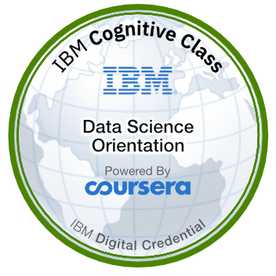

### Hi there 👋,
I am **Rafael** (aka Configutron Prime), a **Full Stack Product Manager** you probably haven't met yet. My happy place is the part of the Product Development Life Cycle where I get to work with developers and turn product requirements into usable features.

:shipit: I know WE ALL LIVE for the moment we get to SHIP TO PRODUCTION... but do you love the gut-wrenching/exciting process of getting there?  
Most people don't, but <b>I DO</b>!

:floppy_disk:  <b>CODE STACKS</b> 
I've worked on the development of a web-based SaaS Health Care platform, a custom CRM application, an EdTech Platform, an Enterprise Debt Collection (Fintech) Platform, and most recently, in e-Commerce using these languages:
<ul>
<li>Scala, MySQL, Kafka (data streaming platform), Angular</li>
<li>Ruby on Rails, Active Admin, PostgreSQL, Angular</li>
<li>C#/.NET, Node.js, SQL Server, React JS</li>
  <li>Java, Python, Django, Javascript</li>  
</ul>  

:zap: <b>INTEGRATIONS</b>
<ul>
<li><b>Narvar</b> (e-Commerce Order Tracking, Returns & Exchanges)</li>
<li><b>Twilio</b> (SMS, MMS & Broadcast web-based messaging services)</li>
<li><b>SendGrid</b> (Transactional and Marketing email services)</li>
<li><b>Stripe</b> (Ecommerce payments and Subscription services)</li> 
<li><b>Bee Plugin</b> (Email Design)</li>
<li><b>FlatFile</b> (Data imports)</li>
</ul>  

:link: <b>CONFIGURATION</b> 
I spent several years building out a Suite of Configuration tools, first in JSON, then JSON, and YAML. I take notes in YAML using a text editor. If numbers are your thing, I made <b>1,004 contributions in 2018</b>. 
<ul>
<li><b>CMS (Content Management Systems)</b>: WordPress, Active Admin, Django, Drupal and Custom CMS tools</li>
<li>JSON</li>
<li>YAML</li>
</ul>  

:cloud: <b>INFRASTUCTURE TOOLS & SERVICES</b>
<ul>
<li>AWS</li>
<li>Kubernetes</li>  
<li>Azure DevOps</li>
</ul>  

  

    
  

  

    
  

<!--
**rafabkny/rafabkny** is a ✨ _special_ ✨ repository because its `README.md` (this file) appears on your GitHub profile.

Here are some ideas to get you started:

- 🔭 I’m currently working on ...
- 🌱 I’m currently learning ...
- 👯 I’m looking to collaborate on ...
- 🤔 I’m looking for help with ...
- 💬 Ask me about ...
- 📫 How to reach me: ...
- 😄 Pronouns: ...
- ⚡ Fun fact: ...
-->
